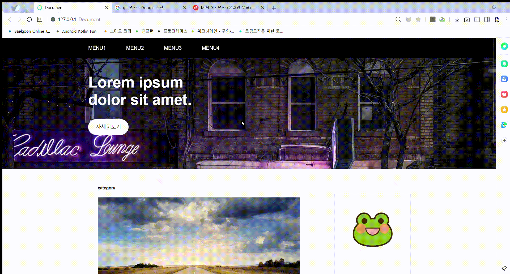
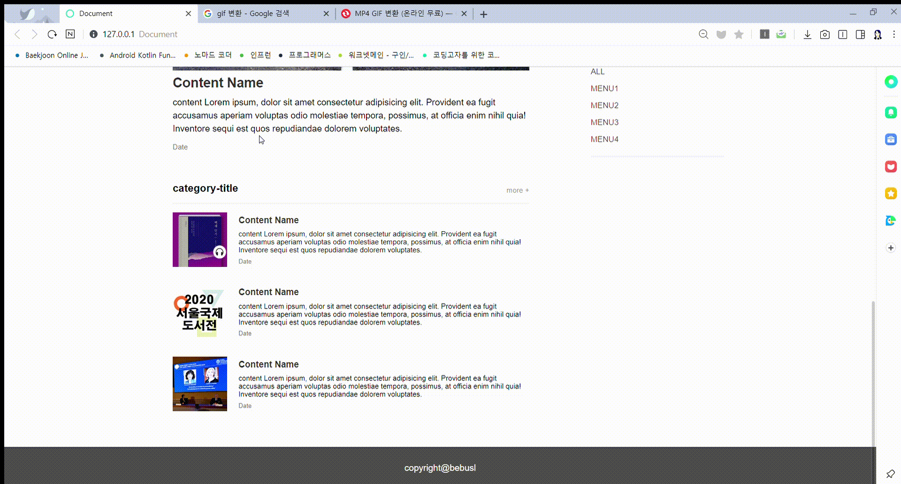

# 1. 과제 주제 설명
- 5주차에 배운 transition, transform, animation을 활용하여 홈페이지의 꾸미는 것이 이번 과제의 주제입니다.
- 블로그 레이아웃을 만들어봤습니다.
  
  <br/>
# 2. 주요 코드 설명

## 배너에 타이틀과 버튼 날아오는 효과

``` 

.banner-description{
    margin:0;
    padding:50px 0;
    font-size:3em;
    animation-name: banner-title;
    animation-duration: 1.5s;
    animation-timing-function: ease-out;
}/*배너에 글귀 부분*/


.banner-button{
    margin:0 auto;
    color:black;
    background-color: white;
    padding:1em 1.5em;
    border-radius: 30px;
    text-decoration: none;
    animation-name:banner-button;
    animation-duration : 2s;
}/*배너에 버튼 부분*/

   
@keyframes banner-title{
    from {margin-left :-300px;}
    to{ margin-left : 0px;}
}

@keyframes banner-button{
    from {opacity : 0;}
    to{ opacity : 1;}
}
```
* animation으로 margin을 조정해 타이틀은 왼쪽에 숨겨져 있다가 배너에 나타나는 형식으로, 버튼은 투명하다가 점점 불투명해지게 만들었습니다.
* 각각 속도가 알맞게 animation-duration으로 애니메이션이 실행되는 속도를 맞춰주었고, animation-timing-function은 ease-out으로 설정해주었습니다.

## 리스트에 글씨 놓으면 리스트의 이미지가 커지는 효과

``` 
.contents-list li:hover img{
    width:110px;
    height:auto;
    z-index:300;
    transition-duration: 0.5s;
}
```
* 컨텐츠 리스트에 마우스를 올리면 해당 리스트의 이미지가 기존 98px에서 110px로 크기가 커지도록 만들어 주었습니다. 커지는 속도를 0.5초로 설정해주었습니다.


## 스크롤 업 다운시 네비게이션 보이기/없애기

``` 
.up{
    top:0;
    opacity:1;
    transition-timing-function:ease-out;
    transition-duration: 0.3s;
}

.down{
    top:-4em;
    opacity:0;
    transition-delay:0.2s;
    transition-timing-function:ease-out;
    transition-duration: 0.3s;
}
```
* js로 스크롤을 올리고 있는지 내리고 있는지 판단해 스크롤을 올리면 up클래스를 추가합니다. 내릴 때는 반대로 down클래스를 추가합니다.
* up클래스는 네비게이션을 천천히 자연스럽게 내려오게 만들어줍니다. opacity를 0에서 1로 만들어주고 위치도 top -4em에서 0으로 바꿉니다.
* 0.3초동안 변환이 일어나게 했고, transition-timing-function은 ease-out으로 설정했습니다.

<hr/>

# 3. 비고 및 고찰 
- 이런 트랜지션, 트랜스폼, 애니메이션은 많이 사용해보지 않았어서 어려울 거라고 생각했습니다. 그렇지만 아주 간단한 효과는 충분히 쉽게 만들 수 있었습니다.
- 인터넷을 찾아보니 트랜지션, 트랜스폼, 애니메이션으로 엄청 화려하게 만든 홈페이지들이 있었는데 그런 것도 나중에 따라서 한 번 구현해 보면 큰 도움이 될 것 같습니다.